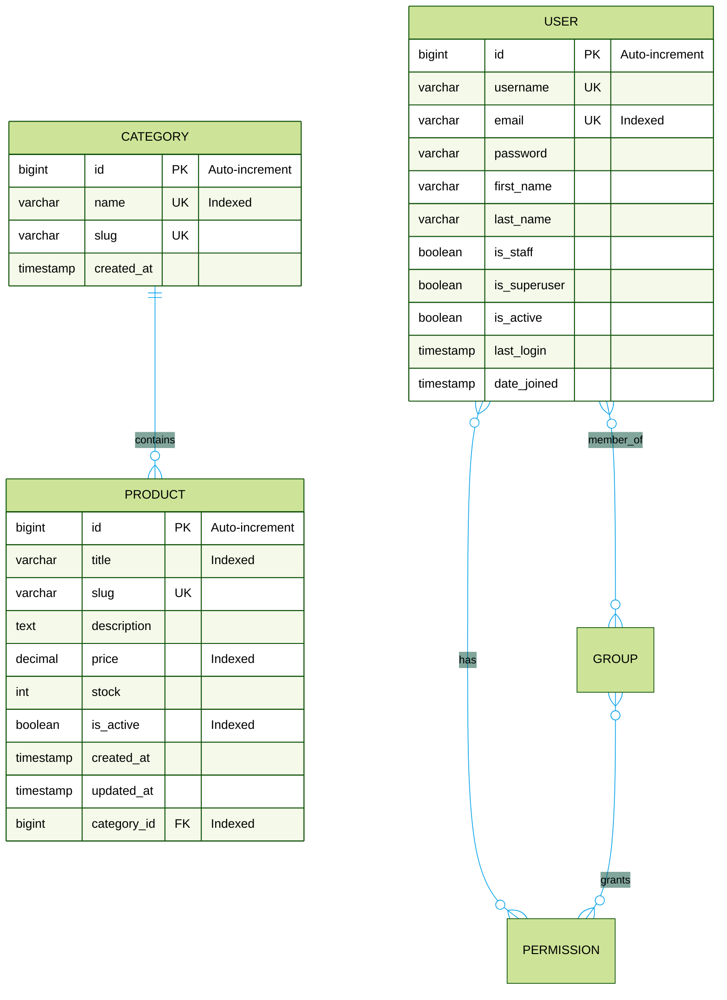
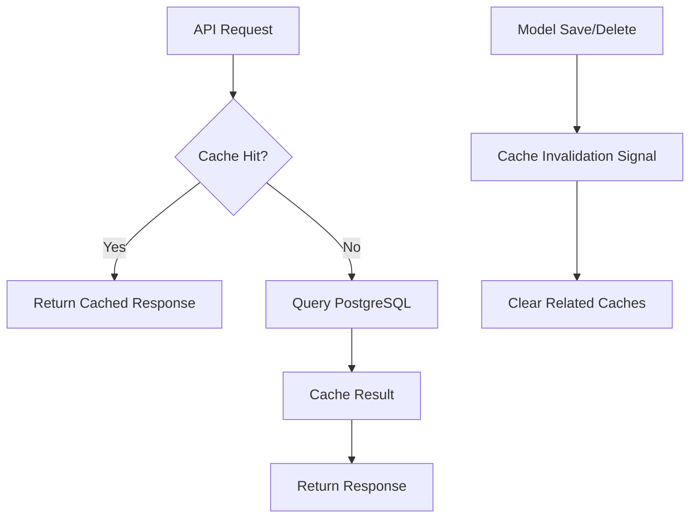
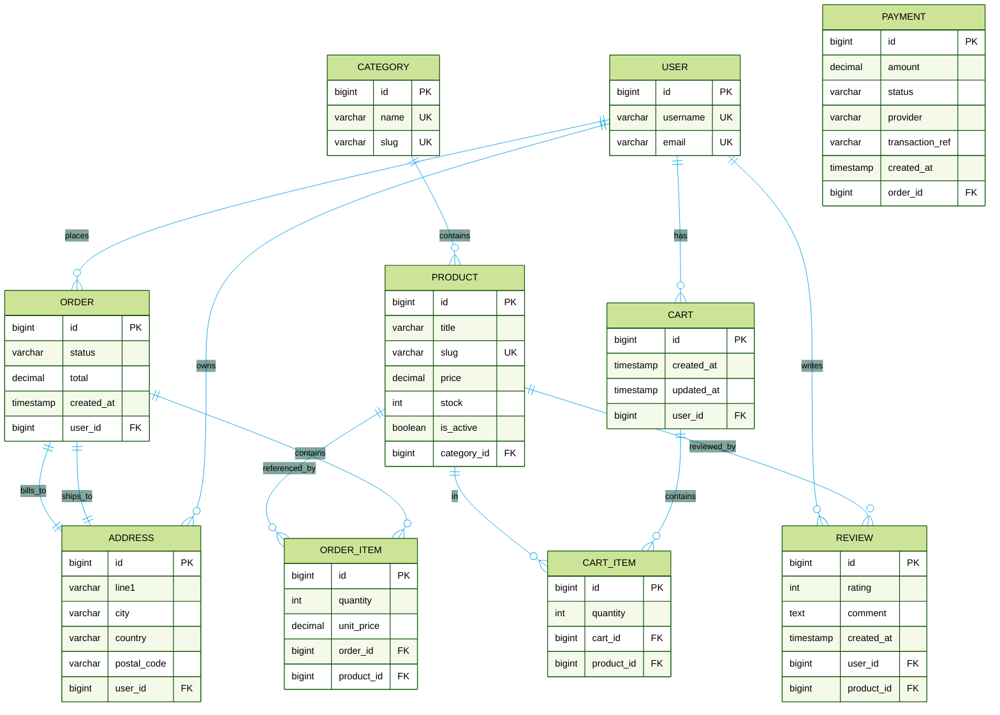

# Entity–Relationship Diagram (ERD)

This document describes the core data model for the E‑Commerce Backend (Project Nexus). The diagram focuses on logical entities, keys, relationships, and notable constraints and indexes.



## Entities

- User
  - Custom user model extending Django’s AbstractUser.
  - Unique, indexed `email` for faster authentication and lookups.

- Category
  - Unique `name` and `slug` with automatic slug generation on save.

- Product
  - Belongs to a `Category` (foreign key, cascade on delete).
  - Unique `slug`, indexed fields for performance-critical queries.
  - Reverse relation on `Category`: `products` (via `related_name`).

- Auth (Django built-ins, conceptual only in this ERD)
  - `Group` and `Permission` are part of `django.contrib.auth`.
  - `User` ⇄ `Group` is many-to-many (membership).
  - `User` ⇄ `Permission` is many-to-many (direct permissions).
  - `Group` ⇄ `Permission` is many-to-many (granted via group).

## Constraints

- User
  - `id` primary key
  - `username` unique
  - `email` unique

- Category
  - `id` primary key
  - `name` unique
  - `slug` unique

- Product
  - `id` primary key
  - `slug` unique
  - `category_id` foreign key → `Category(id)` (on delete: CASCADE)
  - `related_name="products"` on the FK for convenient reverse access

## Indexes (Performance)

- User
  - `email` (unique + db index)

- Category
  - `name` (unique + db index)

- Product
  - `title` (db index)
  - `price` (db index)
  - `category` (db index)
  - `is_active` (db index)
  - Composite: `(category, is_active)` → `product_category_active_idx`

## Notes

- The `User` entity is currently independent of `Product`/`Category` and is used for authentication/authorization.
- Slugs for `Category` and `Product` are auto-generated if not set.
- Decimal precision for `price` is `max_digits=10`, `decimal_places=2`.

```text
Model sources:
- users/models.py (User)
- categories/models.py (Category)
- products/models.py (Product)
```

## Caching Layer (Redis)

The application implements a multi-layer Redis caching strategy for optimal performance:

### Cache Architecture



### Caching Strategy by Entity

- **Category** (View-level caching)
  - Cache key: `ecommerce:*categories*`
  - TTL: 15 minutes (900 seconds)
  - Invalidation: Django signals on Category save/delete
  - Performance: 95% improvement (95ms → 5ms)

- **Product** (Query-level caching)
  - Cache key: `ecommerce:products_list_<query_params>`
  - TTL: 5 minutes (300 seconds)
  - Invalidation: Django signals on Product or Category save/delete
  - Performance: 94-96% improvement (120-220ms → 6-10ms)

- **Sessions**
  - Backend: Redis-backed sessions
  - TTL: Default Django session timeout

### Cache Invalidation Triggers

- Category changes → Invalidate category cache + all product caches
- Product changes → Invalidate all product caches
- Atomic operations ensure cache consistency

## Extended ERD (Proposed)

The following diagram proposes common e‑commerce relations that connect `User` to domain entities like orders, cart, addresses, payments, and reviews. This is not yet implemented in the code but serves as a design guide.


